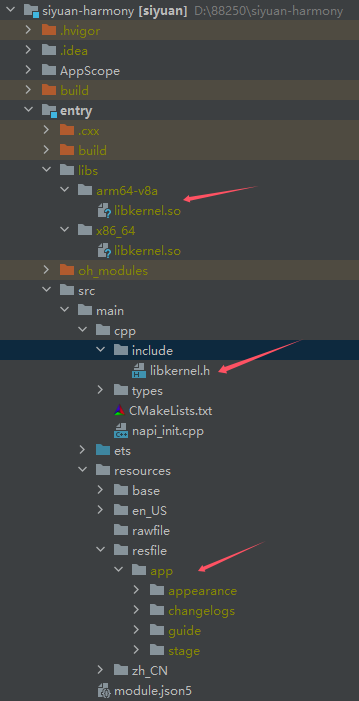

[English](https://github.com/siyuan-note/siyuan-harmony/blob/master/README.md)

## 概述

* Please go to [SiYuan issues](https://github.com/siyuan-note/siyuan/issues) to report issues/consult discussions
* Code contributions are welcome

## Construction guide

1. Refer to [SiYuan Development Guide](https://github.com/siyuan-note/siyuan/blob/master/.github/CONTRIBUTING.md) to compile the kernel
2. Copy the resource files to entry/src/main/resources/resfile/app/
    * appearance
    * guide
    * stage
    * changelogs

Directory structure reference:

