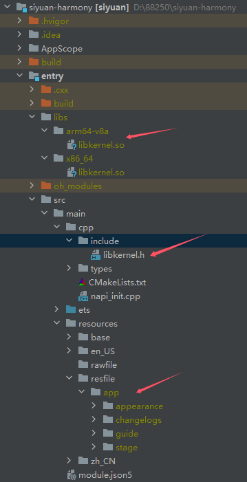
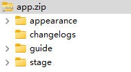

[中文](README.zh-CN.md)

## Overview

* Please go to [SiYuan issues](https://github.com/siyuan-note/siyuan/issues) to report issues/consult discussions
* Code contributions are welcome

## Construction guide

1. Refer to [SiYuan Development Guide](https://github.com/siyuan-note/siyuan/blob/master/.github/CONTRIBUTING.md) to compile the kernel
2. Build the native OCR runtime from the official ONNX Runtime v1.24.3 checkout with `python3 ../siyuan/scripts/build-ocr-harmony.py --source <onnxruntime-checkout> --ndk <sdk-native-directory> --protoc <host-protoc-3.21.12> --output entry/libs --arch arm64-v8a --work-dir <build-directory>`. The script adapts a separate source copy for Harmony Clang 15, retaining FP32/INT8 NEON inference and disabling BF16/FP16 vector paths and I8MM optimizations. The working directory retains sources, dependencies and compiled objects so the same command can resume after a failure; use a new working directory when changing the architecture, SDK or source adaptations. Use `--arch x86_64` for the emulator. CMake refuses to package a missing runtime
3. Prepare the bundled models with `python3 ../siyuan/scripts/prepare-ocr.py`; package `stage/ocr/models` and the license files in the resources alongside the frontend. Android and desktop runtime directories under `stage/ocr/runtime` are excluded from the mobile resource bundle
4. Copy the resource files and package it in entry/src/main/resources/rawfile/app.zip
   * appearance
   * guide
   * stage
   * changelogs

For unreliable networks, use `--deps-mirror <mirror-directory>` to provide the local dependency mirror supported by upstream CMake. Store archives under their original URL host and path, for example `<mirror-directory>/github.com/onnx/onnx/archive/refs/tags/v1.20.1.zip`. The pinned source's `cmake/deps.txt` defines the versions and checksums, which CMake still verifies. Dependencies absent from the mirror are downloaded from upstream.

Directory structure reference:

